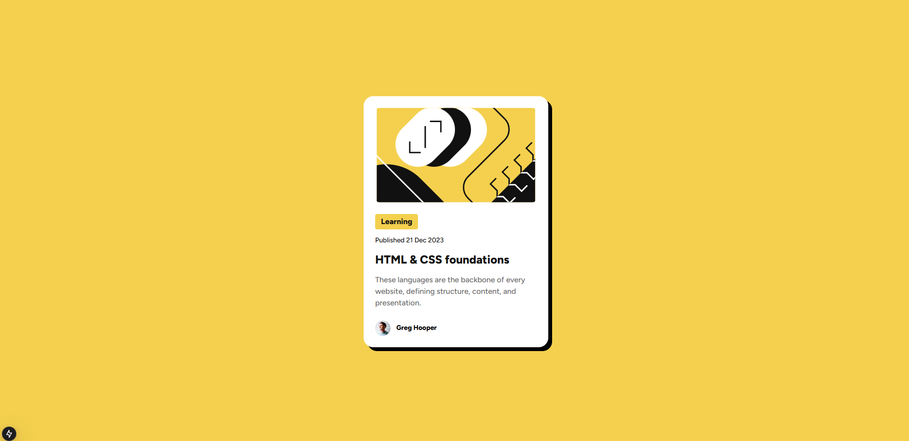

# Frontend Mentor - Blog preview card

This is a solution to the [Blog preview card challenge on Frontend Mentor](https://www.frontendmentor.io/challenges/blog-preview-card-ckPaj01IcS).

## Table of contents

- [Overview](#overview)
  - [Screenshot](#screenshot)
  - [Links](#links)
- [My process](#my-process)
  - [Built with](#built-with)
- [Author](#author)

## Overview

### Screenshot

### Links

- Solution URL: [https://github.com/lemicba/01-qr-code](https://github.com/lemicba/01-qr-code)
- Live Site URL: [https://lemicba.github.io/01-qr-code/](https://lemicba.github.io/01-qr-code/)

### Built with

- Semantic HTML5 markup
- Tailwind
- Next Js
- Mobile-first workflow
- [React](https://reactjs.org/) - JS library
- [Next.js](https://nextjs.org/) - React framework
- [Tailwind](https://tailwindcss.com/) - For styles

## Author

- Website - [Emiliano Ceballos]
- Frontend Mentor - [@lemicba](https://www.https://www.frontendmentor.io/profile/lemicba)
